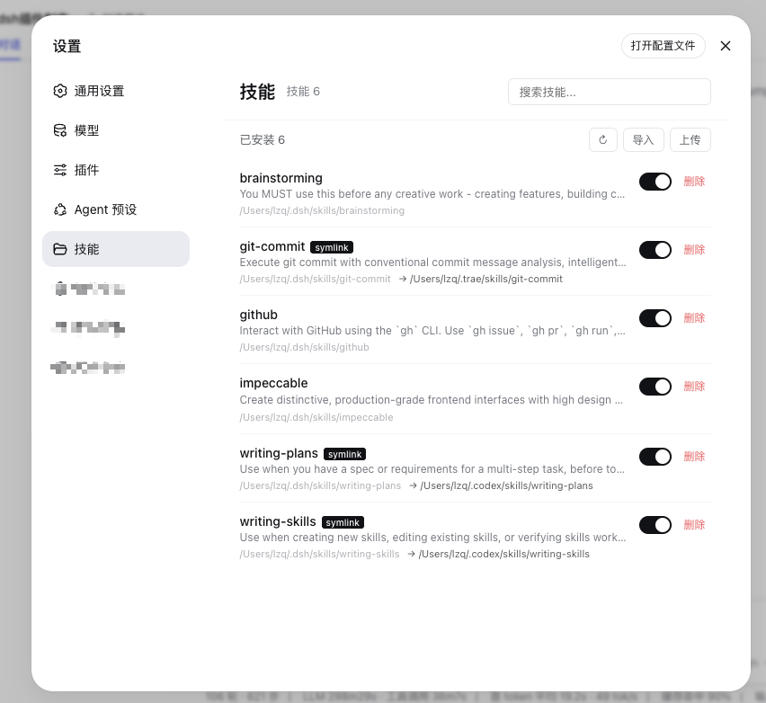
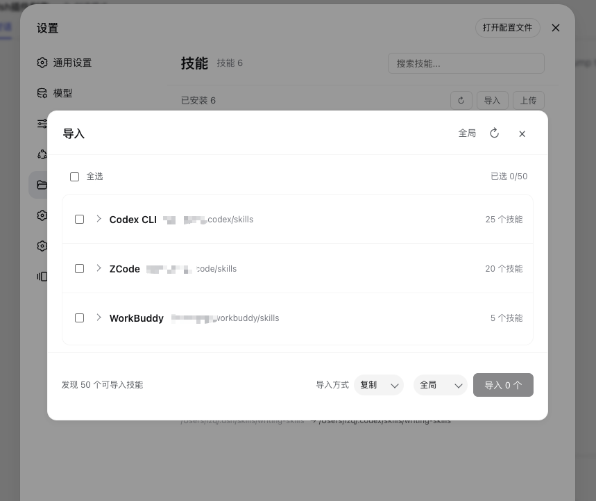
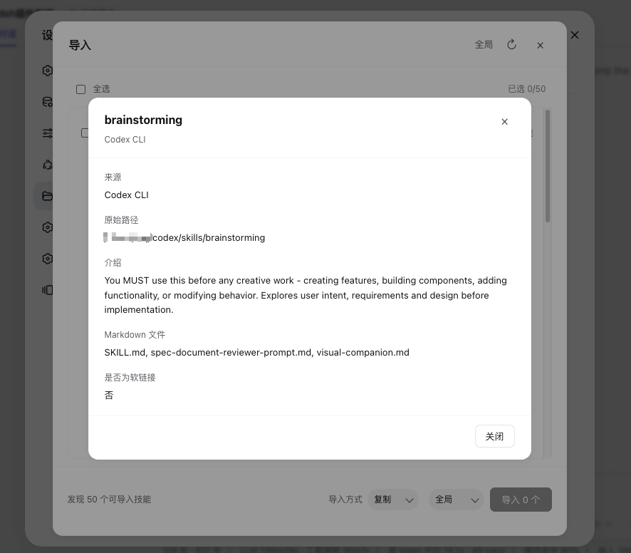

# dsh-skills-hub

DSH Skill Manager — 集中管理所有 AI Agent 的 Skills

[English](README.md) | [简体中文](README.zh.md)

## 🎯 项目目标

为 DeepSeek Harness (DSH) 提供一个**统一的 Skill 管理界面**,让用户可以在一个地方查看、启用/禁用、删除、导入来自不同 Agent 平台(DSH、Codex、ZCode 等)的 Skills。

## ✨ 核心功能

- **Skill 浏览器**:列表展示所有已发现的 skills,支持搜索过滤
- **一键操作**:启用/禁用、删除、打开文件夹、编辑
- **跨平台导入**:从 Codex、ZCode 等平台一键导入 skills
- **自动发现**:扫描全局/工作区/符号链接的 skills

### 截图







## 📐 需求规格

详见 [SPEC.md](SPEC.md)

## 🏗️ 技术栈

- DSH Client Plugin (Web)
- React + TypeScript
- CSS Modules
- DSH Slot System

## 📦 安装

需要使用带有**浏览器客户端**的 DeepSeek Harness 部署方式，包括带 Web UI 的**桌面版**或 **Web 版**。安装后，在 DSH 的**设置 → 技能**中打开技能管理页面。

```sh
pnpm add @lcthe/dsh-skills-hub
```

然后在 `cordis.yml` 中、与其他 bundle 项目相同的 include 层级添加插件：

```yaml
- insert:
    - id: dsh-skills-hub
      name: '@lcthe/dsh-skills-hub'
```

启动 DSH Web 客户端：

```sh
pnpm dsh web
```

DSH 启动后，打开**设置 → 技能**即可管理已安装的 skills。插件会扫描 DSH 自己的 skills 目录，并发现 Codex、Claude Code、ZCode、WorkBuddy 和 QCoderWork 中可导入的技能。

### 本地开发

如果要使用本地源码而不是已发布的 npm 包，可以在 DSH profile 的 `package.json` 中添加 `file:` 依赖：

```json
{
  "dependencies": {
    "@lcthe/dsh-skills-hub": "file:/path/to/dsh-skills-hub"
  }
}
```

然后将 `@lcthe/dsh-skills-hub` 加入 `dsh.profile.bundles`，并在源码目录执行构建：

```sh
pnpm install
pnpm run build
```


## 🤝 贡献

欢迎提交 Issue 和 PR!

## 📄 License

MIT
